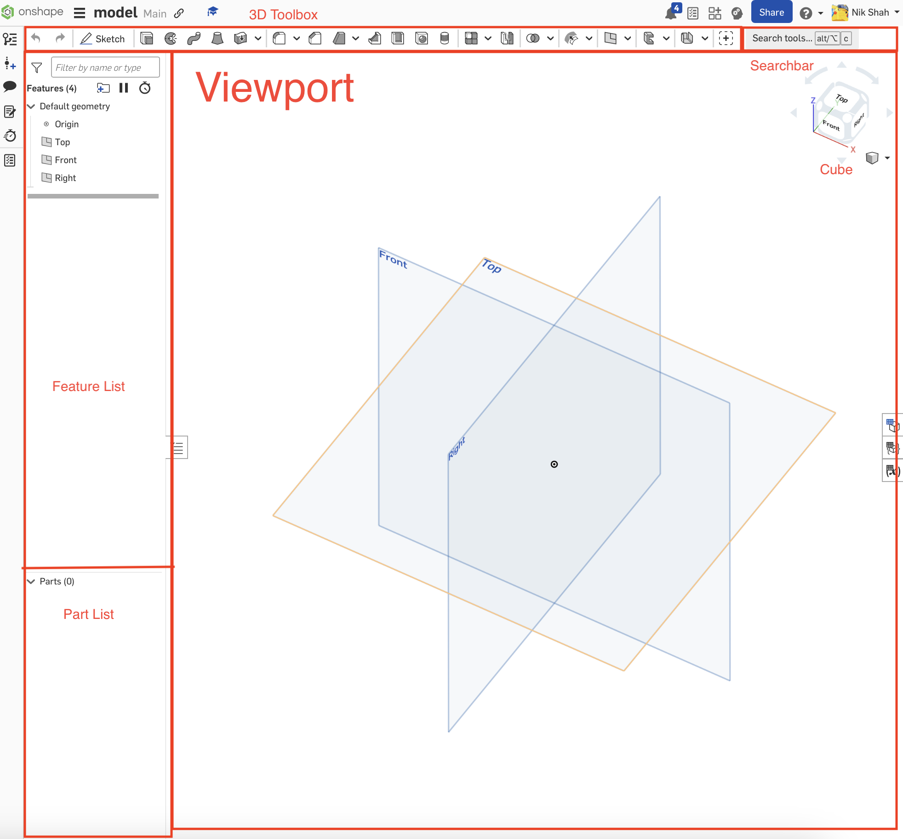

# Key Cad Concepts

On this page you'll find various guides and information on CAD! We mainly use [Onshape](https://www.onshape.com/en/), a free online CAD package with support for FTC.
If you have an account, you should already be added to our MS Robotics group which gives you access to hundreds of models of GoBilda and RevRobotics parts to use in your models. \
If you don't have an account, you can use your school email to make a free account.

# Your First Part
So you are ready to make your first part!\
First click "Create" then on the drop down menu click "Document"\
Now you are in your first Document/Project! It might seem a bit overwhelming with all the things right now but we are going to break it down step by step.

This is what we like to call the **"viewport"** As you can see there are 3 planes in it. We will get into them later but for now all you need to know is that they give reference to the rest of the project. You will also see a cube in the corner, this cube allows you to quickly change the plane you are viewing. You can also use right click or two finger click to change camera angles.\
IMAGE RAHHHHH
This is the **"Feature List"**, it displays all of your feature on your project. It is spilt into two parts, the features, and the parts. Features are things that modify parts and are generally what you use in Onshape. Parts are thier own objects, you mainly use them to tell if things are connected, export things, or put them into an assembly.\

This is the **toolbar**. It is where you access all your tools. The **search bar** on the right allows you to search for specfic tools. Now there are two different tool bars, the **sketch tools**, and the **3D tools**. The one you see right now are the 3D tools, but you will have to be fluent with both to model effiectly.\

Now that you have learned the layout of Onshape lets make your first part, a symetirical box. First click "Sketch" on the left side of the 3D toolbox.\
Next click the top plane, and adjust your view to being looking at the top plane head-on. This should swap your toolbox into the sketch toolbox. Sketch one of the most important tools in Onshape. To make something 3D, you must start with something 2D first! Now that you've created a sketch you have to draw something. We are making a box, and the 2D version of a box is a sqaure. So looking at the sketch toolbox, can you find the rectangle tool?\ 
Once you've found it draw a rectangle of any shape or size, then click "esc" we will make it a sqaure in the next step.\
Now click "d" to start a **smart dimension**, this allows you to make lines in sketches specfic lengths, you will use this tool a lot so you will want to get used to it.\
After clicking "d", your cursor should become a plus sign. Now click on one of the sides of the rectangle, drag out cursor off the line, if you did this right a black arch should be following your cursor. Once you've dragged it off the line click again, this should make a textbox apperer, this is where you can type in any length you want.\ 
Now click "enter" and repeat for a perpendicular side to the one you dimensioned. Because it is a sqaure make it the same length. You may be asking why we only need to do two sides and this is because you used the rectangle tool. When you make a rectangle oppisite sides are forced to be the same length so you only need to change 2 sides. If you do all 4 Onshape with give an error, as now two liens that are supossed to be the same length are recieving directions to be different lengths. Even if you set both to the same length Onshape will still glitch. Compare it to two people screaming in your ear at the same time, even if they are saying the same thing, its hard to understand.\
Now click the 

[Home Page](https://potatzz.github.io/ms-robotics-resources.github.io/) || [Table of Contents](https://potatzz.github.io/ms-robotics-resources.github.io/table_of_contents.html)
